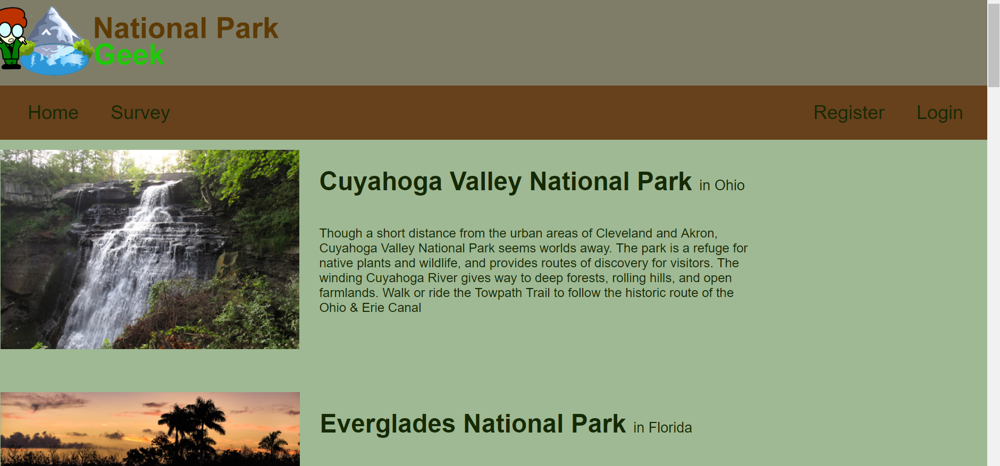
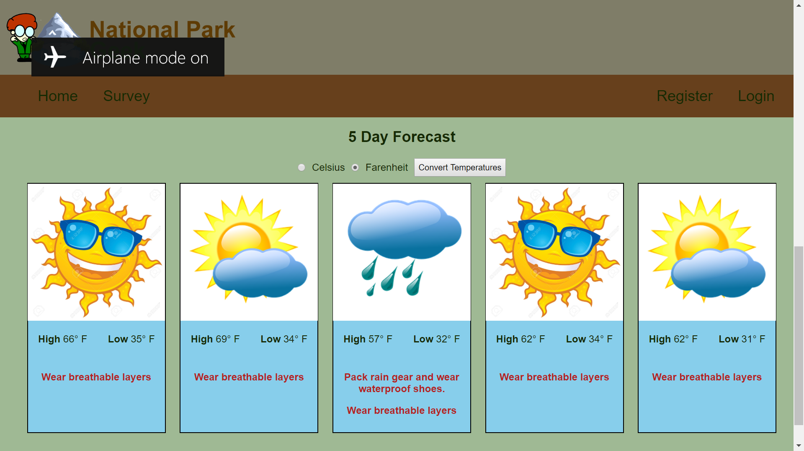

# National Park Weather Service Capstone
Module 3 capstone at Tech Elevator

## Functionality
* User can display national parks which is pulled from a SQL database
* Selecting a park will display a detailed informtional page about the park.
* Users can register and login to the site
* Logged in users can participate in a survey which takes them to a results page displaying user's top rated parks.
* Temperature can be toggled from farenheit to celsius and user's preference is saved in session.
* Alerts are displayed based on temperature and weather conditions

## Screenshots

## Languages and Tech Used
* [C#](https://docs.microsoft.com/en-us/dotnet/csharp/)
* [HTML](https://developer.mozilla.org/en-US/docs/Web/HTML)
* [CSS](https://developer.mozilla.org/en-US/docs/Web/CSS)
* [Visual Studio 2017](https://visualstudio.microsoft.com/vs/whatsnew/)
* [SSMS](https://docs.microsoft.com/en-us/sql/ssms/sql-server-management-studio-ssms?view=sql-server-2017)
* [SQL](https://docs.microsoft.com/en-us/sql/?view=sql-server-2017)
* [Razor](https://docs.microsoft.com/en-us/aspnet/core/mvc/views/razor?view=aspnetcore-2.2)

## Developed by
* Ryan Pearce & Tyler Teran

